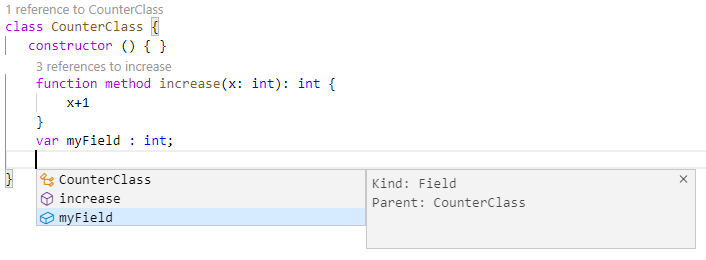

# Dafny for Visual Studio Code (Preview Release)

⚠️ Warning: This is a **Preview Release** for extension development purposes. Please us the stable version if you just want to use Dafny. Please note that only one of the two plugins may be active.
The Dafny language server supports only Windows at this moment.

This extension adds _Dafny_ support to Visual Studio Code.
This VSCode plugin needs the Dafny language server, which is placed in a [separate git repository](https://gitlab.dev.ifs.hsr.ch/dafny-ba/dafny-language-server).

## Features

- **Compile and Run** `.dfy` files.
- **Verification** as one types.
  - Errors, warnings and hints are shown through the VSCode interface.
  - When there are no errors, you get a 👍 on the status bar.
- **Syntax highlighting** thanks to [sublime-dafny](https://github.com/erggo/sublime-dafny). See file `LICENSE_sublime-dafny.rst` for license.
- Display **CounterExample** for failing proof.
- **_AutoCompletion_** to suggest symbols.
- **_CodeLens_** showing method references.
- **GoToDefinition** to quickly navigate.
- **Hover Information** for symbols.
- **Rename** for code refactoring.

You can find [examples below](#examples).

## Shortcuts

| Shortcut                  | Description                                                                             |
| :------------------------ | :-------------------------------------------------------------------------------------- |
| `Ctrl+Shift+B` or `⇧+⌘+B` | Compile to `.dll` or, if there is a `Main` method, to `.exe` file                       |
| `F2`                      | Rename a symbol                                                                         |
| `F5`                      | Compile and run, if the source file has a `Main` method                                 |
| `F6`                      | Compile with custom arguments                                                           |
| `F7`                      | Show _CounterExample_                                                                   |
| `F8`                      | Hide _CounterExample_                                                                   |
| `F9`                      | Restarts the _Dafny Language Server_, also installs the latest language server version. |

## Requirements

- The plugin requires at least .NET Core 3.1 to run the _Dafny Language Server_. Please download a distribution from [Microsoft](https://dotnet.microsoft.com/download).
  - Note: When you first open a _Dafny_ file, the extension will prompt you to automatically install .NET Core. The language server gets installed automatically.
- In case you would like the plugin to use a different _Dafny Language Server_ distribution, set the path to the `DafnyServer.exe` file via the `dafny.languageServerExePath` in the user setting.

## Extension Settings

| Setting                           | Description                                                                                                                                                                                        | Default                                                        |
| :-------------------------------- | :------------------------------------------------------------------------------------------------------------------------------------------------------------------------------------------------- | :------------------------------------------------------------- |
| `dafny.languageServerRuntimePath`     | Absolute or relative path to the _Dafny_ language server runtime (`DafnyLS.dll`).                                                                                                                       | `../../dafnyLanguageServer/DafnyLS.dll` |
| `dafny.languageServerLaunchArgs`  | Optional array of strings as _Dafny_ language server arguments.                                                                                                                                    | `[ ]`                                                          |
| `dafny.compilationArgs`           | Optional array of strings as _Dafny_ compilation arguments.                                                                                                                                        | `[ "/compile:1", "/nologo" ]`                                  |
| `dafny.dotnetExecutablePath`        | Dotnets absolute path. Only necessary if dotnet is not in system PATH (you'll get an error if that's the case).                                          |                                                                |
| `dafny.colorCounterExamples`      | Customize the color (HEX) of Counter Examples. There are two default colors: for dark theme (#0d47a1, #e3f2fd) and light theme (#bbdefb, #102027). This color setting will override both defaults. | `{ "backgroundColor": null, "fontColor": null }`               |

Please note that in this new plugin version "automatic verififaction" is always on and a language server side feature.

## Examples

Here are a few impressions of the features.

### Installation

On the first start the plugin will install the _Dafny_ language server automatically.

### Syntax Error Underlining

Whenever a postcondition statement does not hold, the user will be informed.

### Compile and Run

Press `F5` to compile and run the program.

### Show Counter Example

Press `F7` to show counter examples.

### CodeLens

Counted references will automatically be displayed. Click on one of those reference to open the CodeLens popup.

### Auto Completion

Press `CTRL+Space` to show auto completion suggestions.

### Hover Information

Hover a symbol to get information about that symbol.

### Rename

Press `F2` to rename a symbol.

## Contribute

This is a MIT licensed open-source project that lives from code contributions.

We welcome your help! For a description of how you can contribute, as well as a list of issues you can work on, please visit the [Dafny-VSCode GitHub repository](https://github.com/DafnyVSCode/ide-vscode).
